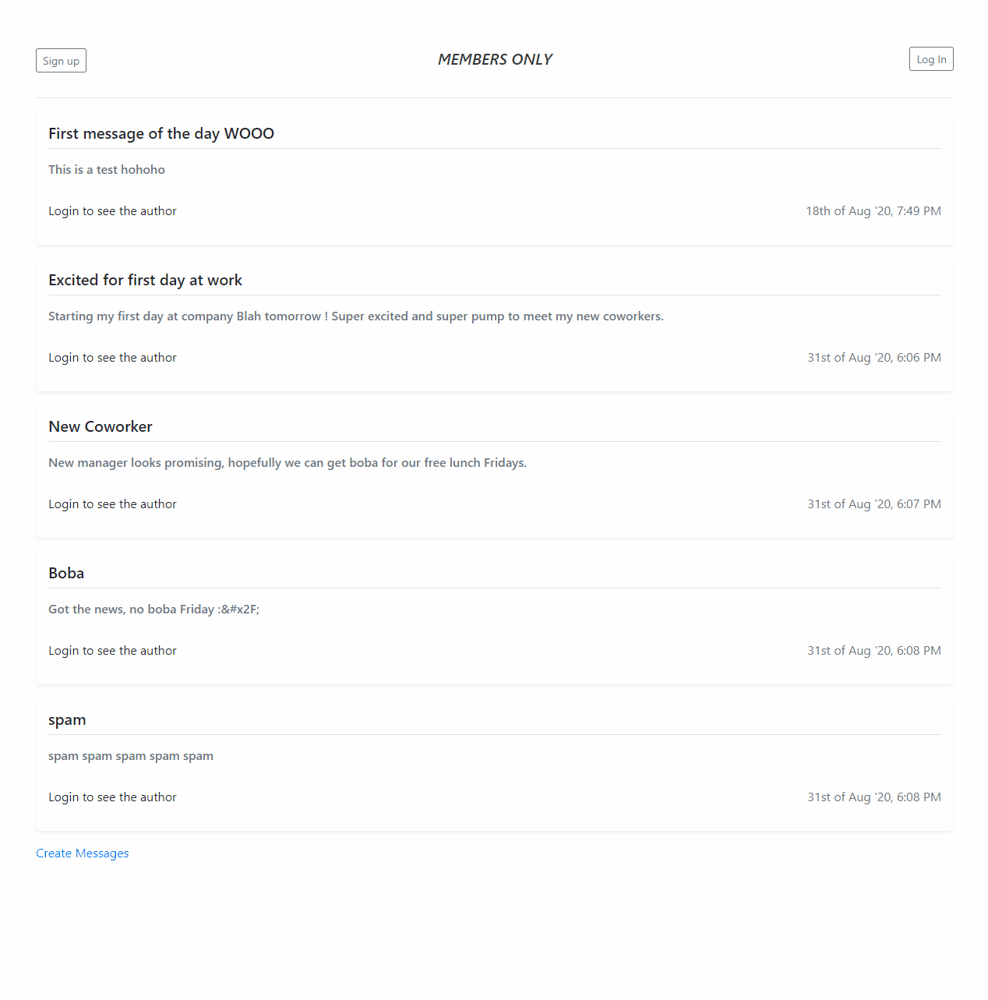

# members-only

### About this App ###
An "exclusive clubhouse" where members can write posts about other members or nonmembers. Inside the clubhouse, members can see who the author of a post is, 
but outside they can only see the story and wonder who wrote it. Only members are allowed to create posts and see the authors of posts. Only admins are allowed
to edit and delete posts. This app is an introduction to using Passport for authentication and BcryptJS to hash and authenticate passwords.

### Technologies Used ###
* NodeJs Web Application framework: Express
* BcryptJS 
* Passport
* MongoDB to store data
* Bootstrap for frontend framework, PUG for viewing template
